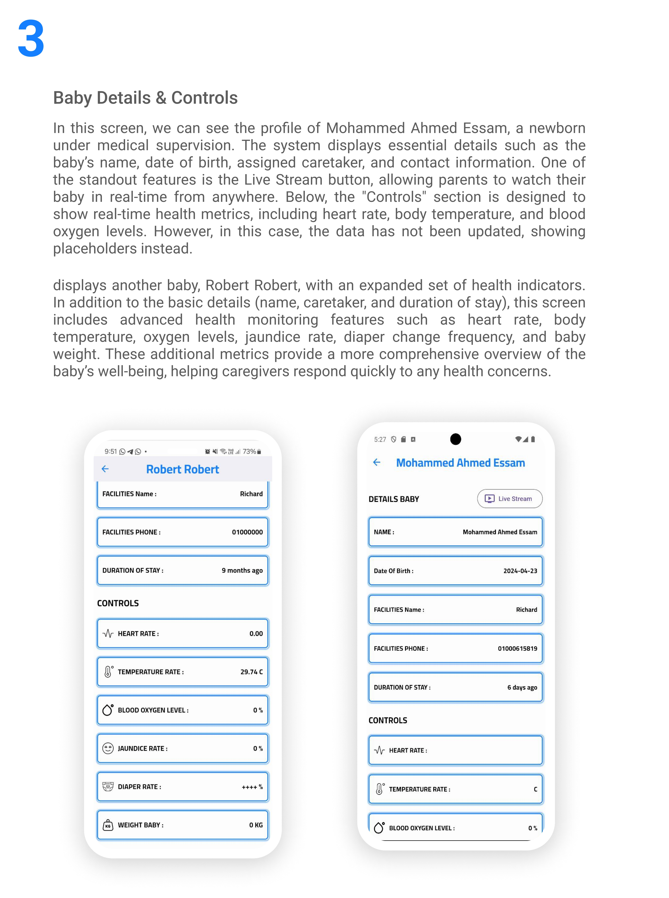

# Baby Zone - Smart Incubator App

🌟 **Revolutionizing Newborn Care with Smart Technology** 🌟

---

## 📖 About the Project
**Baby Zone** is a state-of-the-art smart incubator system designed to ensure the safety and well-being of newborns. This project combines advanced hardware with an intuitive mobile app, providing parents and caregivers with real-time monitoring and control capabilities. Whether you're checking your baby's vitals or watching them through live streaming, Baby Zone makes it all possible.

---

## 🔑 **Key Features**
### Mobile App:
- 📊 **Real-Time Monitoring**: Vital metrics such as:
  - Heart Rate ❤️  
  - Body Temperature 🌡️  
  - Blood Oxygen Levels 🩸  
  - Jaundice Rate and more.  
- 📹 **Live Streaming**: Parents can monitor their baby anytime from anywhere.
- 🚨 **Instant Alerts**: Get notifications for any critical changes.
- 🖥️ **Intuitive User Interface**: Designed for ease of use by both parents and medical professionals.

### Hardware:
- 💡 **Advanced PCB Design**: Equipped with multiple sensors to measure temperature, humidity, oxygen, and CO2 levels.  
- 📡 **Wireless Connectivity**: Supports WiFi/Bluetooth for seamless communication with the mobile app.  
- 🔋 **Energy Efficient**: Designed to minimize power consumption while maintaining high performance.  

---

## 📸 **Screenshots**
Here’s a glimpse of what Baby Zone offers:

### 1. System Overview

*A schematic overview showcasing how the app and hardware communicate seamlessly.*

---

### 2. Mobile App Interface

*User-friendly design tailored for parents and caregivers.*

---

### 3. Advanced PCB Design

*High-precision PCB with sensor integration for real-time monitoring.*

---

### 4. Real-Time Monitoring

*Monitor your baby's health metrics directly from the app.*

---

## 🚀 **How It Works**
1. **Data Collection**: Sensors in the incubator collect real-time vitals and environmental metrics.
2. **Wireless Transmission**: Data is sent to the mobile app via Bluetooth/WiFi.
3. **User Interaction**: Users receive updates, control incubator settings, and view live streams.
4. **Automated Alerts**: Immediate notifications for critical conditions, ensuring swift action.

---

## 🛠️ **Technologies Used**
### Mobile App:
- **Flutter**: Cross-platform framework for Android and iOS.
- **GetX**: For efficient state management and navigation.
- **REST APIs**: Used for real-time data synchronization.

### Hardware:
- **Sensors**: For monitoring vital metrics like temperature, oxygen, and CO2 levels.
- **PCB Design**: Designed to integrate seamlessly with the incubator environment.
- **Embedded Programming**: Used for real-time sensor data processing.

---

## 🛠️ **Challenges Faced**
- Integration of real-time hardware data with the app.  
- Maintaining stable wireless communication between the app and the hardware.  
- Ensuring high performance while optimizing battery consumption.  
- Designing an intuitive interface to cater to non-technical users.

---

## 💻 **How to Run**
Follow these steps to set up and run the app locally:

1. **Clone the repository**:
   ```bash
   git clone https://github.com/AbdalluhEssam/babyzone.git
